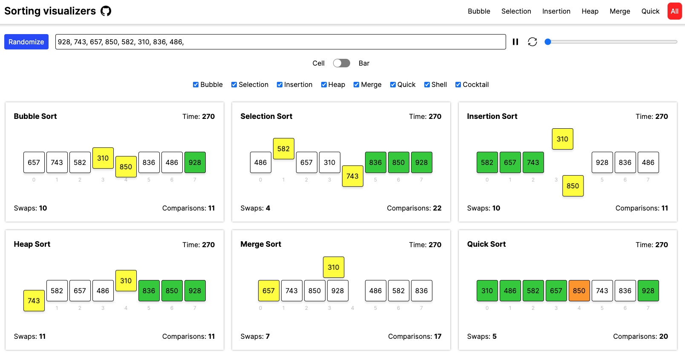
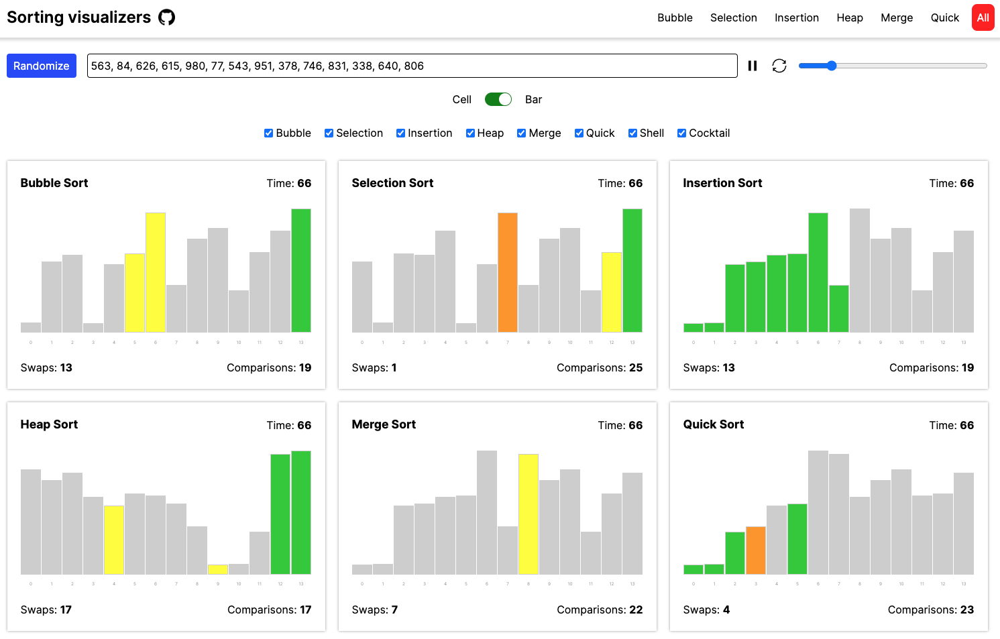

  <h1>Sorting Visualizer</h1>
  <h2>Responsive visualizer built using React for popular algorithms</h2>
  

    
    
    
  

 

<a href="https://sadanandpai.github.io/sorting-visualizer/dist/">See it in
action</a>

---

### This repo is an attempt to help in learning popular sorting algorithms by visualization

Helps to

- understand the working of sorting algorithm
- check total swaps required
- check total comparisions
- compare algorithms side by side
- know the time taken (time is just an approximate unit for comparision)

Features

- Sort any given array of 3 digits positive integers
- Alter the speed of execution
- Start, pause and reset the execution
- Generate random array of numbers of sorting

 

### Technologies

Production libraries
- [React](https://react.dev/) (Frontend Library)
- [Redux Toolkit](https://redux-toolkit.js.org/) (State management)
- [React Router](https://reactrouter.com/en/main/) (Router)
- [React Switch](https://react-switch.netlify.app/) (Switch)
- [Sonner](https://sonner.emilkowal.ski/) (Toast)

Build libraries
- [Sass](https://sass-lang.com/) (CSS compiler)
- [Vite](https://vitejs.dev/) (Bundler)
- [Vitest](https://vitest.dev/) (Unit test)
- [Cypress](https://www.cypress.io/) (E2E test)

 

### Features built using

- Animations are done using pure CSS and uses
  [FLIP principle](https://aerotwist.com/blog/flip-your-animations/)
- Flex is used for array display and manipulation of positions (flex order
  property)
- JavaScript async generators are used heavily for the controlled execution of
  algorithms

 

### Run in your local

- `git clone https://github.com/sadanandpai/sorting-visualizer.git`
- `cd sorting-visualizer`
- `npm install`
- `npm run dev`

---

### Contributing Guide

If you want to contribute, improve or fix bugs in this repo, then check out the
[Contributing Guide](./CONTRIBUTING.md)  

 

### License

This repository is MIT licensed. [Read more](./LICENSE)
